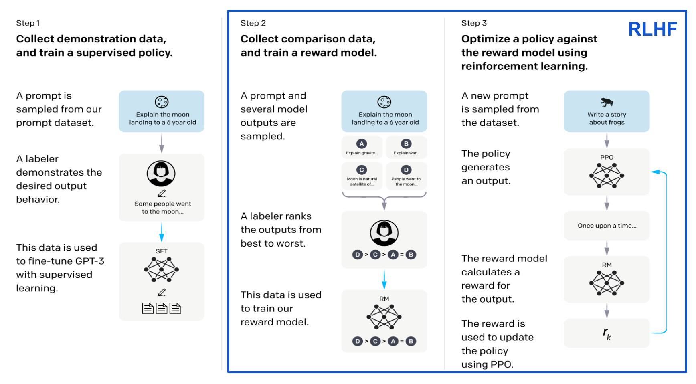
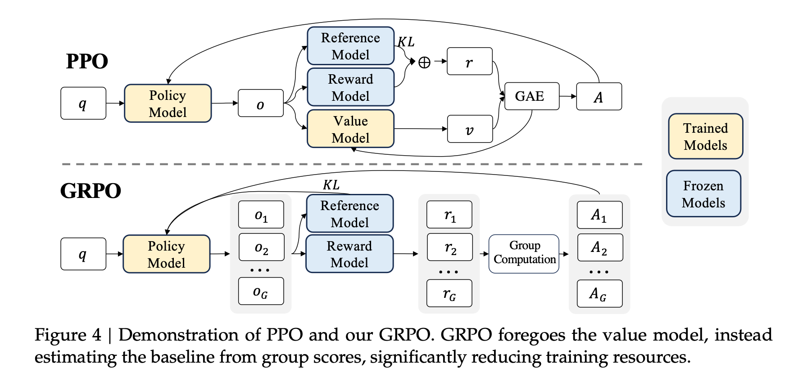
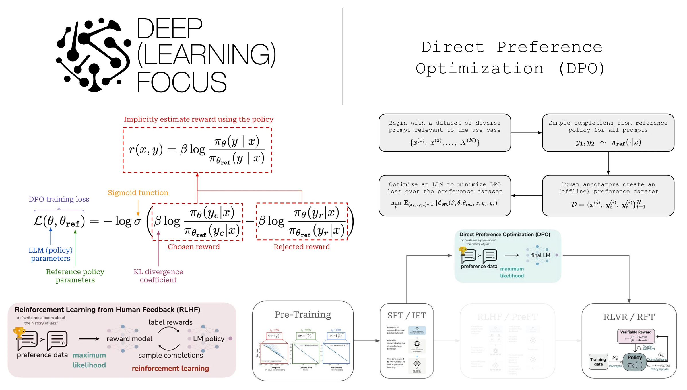

# Governing LLMs

The AI systems being built today will decide how knowledge is distributed and how societies are structured in the next 5–10 years.  

*So who should decide how AI is governed?*
It would be dangerous for this process to fall into the hands of a privileged few. It is up to us (as ML PhD students!) to be informed about and to think critically about how current systems are set up. How can we construct principled systems and work towards a collective project that draws on diverse forms of wisdom (e.g., scientific, ethical, cultural, and institutional) to align models?

Recent works have highlighted gaps between the ideal behaviors specifications AI companies declare and the actual behaviors frontier models exhibit. [SpecEval (2025)](https://arxiv.org/pdf/2509.02464) is one example.

---

# How Does Post-training Work?

A pre-trained LLM is a **next-token prediction machine**.  
Much of the work that makes an LLM *useful* happens in post-training.  

You can think of:
- **Pre-training** as condensing large volumes of information into a smart data structure.  
- **Post-training** as the process of extracting and refining the most relevant information.

  
*Image credit: [1]*

### The Stages

0. **Define a rubric of ideal behaviors:** e.g., follow instructions, be honest and helpful, avoid harmful content.  
- OpenAI relies on a [Model Spec](https://model-spec.openai.com/2025-02-12.html).
- Anthropic has an [AI Constitution](https://constitutional.ai/#definition).
1. **Supervised Fine-tuning (SFT):** Human annotators provide “gold standard” responses, and models imitate these responses.  
2. **Reward Model Training:** The LLM generates two responses, and humans annotate which they prefer.  
3. **Reinforcement Learning (RL):** The LLM learns from trial and error.  
4. **Prompting (In-context learning):** Prompts guide the model on what to output during inference.

---

# RL Defined in an LLM Context

Language modeling fits naturally into a reinforcement learning framework:

- **Policy:** The rule (model weights) determining which token to output.  
- **State:** The input context or prompt.  
- **Action:** The next token chosen by the model.  
- **Reward:** The score assigned to an output (often from a reward model).  
- **Value:** The expected total reward from a state when following a policy.

  
*Image credit: [5]*

---

# RL Algorithms for LLM Post-training

  
*Image credit: [2]*

### Policy Gradient

Policy gradient methods directly optimize a policy $\pi_\theta(a|s)$ to maximize expected reward.  
It updates parameters to increase the likelihood of actions that yielded higher returns:

$$
\nabla_\theta J(\theta) = \mathbb{E}_{\pi_\theta}\big[ R(\tau) \nabla_\theta \log \pi_\theta(\tau) \big]
$$

Intuitively, this nudges the policy toward rewarding behaviors and away from poor ones, without needing a differentiable model of the environment (as we are taking the derivative of the logged policy).  
However, large updates can easily destabilize training, making naive policy gradients sample-inefficient (one rollout per model-update) and sensitive to step size.

### Proximal Policy Optimization (PPO)

**PPO** refines policy gradients by introducing a *clipped surrogate objective* that limits how far the new policy can move from the old one:

$$
L^{\text{PPO}}(\theta) = \mathbb{E}_t\Big[ \min\big( r_t(\theta)A_t,\; \text{clip}(r_t(\theta), 1-\epsilon, 1+\epsilon)A_t \big) \Big],\quad r_t(\theta) = \frac{\pi_\theta(a_t|s_t)}{\pi_{\text{old}}(a_t|s_t)}
$$

The clipping ensures updates stay within a safe ''trust region'', allowing multiple gradient epochs on the same data.  
This makes PPO *stable* and *sample-efficient*, and it has become a default optimizer (before DPO) in large-scale RLHF pipelines.

### Group Relative Policy Optimization (GRPO)

*GRPO* simplifies PPO in *comparative feedback* settings, where we have *relative* judgments (e.g., “response A preferred to response B”) instead of scalar rewards. Instead of training a value function, we compute the average response score of the group. The loss encourages the policy to increase the likelihood of preferred responses relative to less-preferred ones:

$$
L^{\text{GRPO}}(\theta) = \mathbb{E}_{(y_i, y_j)}\Big[ \log \sigma\\Big( \beta \big( \log \pi_\theta(y_i|x) - \log \pi_\theta(y_j|x) \big) \Big) \Big]
$$

---

<!-- motivation for DPO (act as a transition) -->

## DPO (Direct Preference Optimization)

  
*Image credit: [6]*

In this section, we will look at the intuition behind **Direct Preference Optimization (DPO)**: how it connects to the RL objectives of PPO/GRPO, and why its gradient naturally increases the likelihood of *preferred* responses while decreasing that of *non-preferred* ones.

### i. From RLHF to DPO

In RLHF, the objective is to train a model to maximize expected reward under a KL constraint that keeps it close to a reference model (often the SFT model):

$$
\max_{\pi_\theta} \mathbb{E}_{x \sim D,\, y \sim \pi_\theta(y | x)} \Big[ r(x, y) \Big] - \beta \mathbb{D}_{\text{KL}}\big(\pi_\theta(y | x) || \pi_{\text{ref}}(y | x)\big)
$$

where:
- $r(x, y)$ is the reward (learned from human preferences),
- $\pi_{\text{ref}}$ is the reference policy (often the SFT model),
- $\beta$ balances reward maximization vs. staying close to the reference.

### ii. The Optimal Policy

Maximizing with respect to the distribution $\pi_\theta$ yields a closed-form solution for the optimal policy:

$$
\pi_\theta(\beta)^*(y \mid x)=\frac{\pi_{\text{ref}}(y \mid x) \, \exp(\beta \, r(x, y))}{Z_\beta(x)},
$$

where $Z_\beta(x)$ is a normalization constant.

The optimal policy (i) reweights the reference model’s probabilities (ii) shifts more mass toward higher-reward outputs with (iii) $\beta$ controlling for how strong this shift is.

### iii. Pairwise Preferences and the Bradley–Terry Model

Human feedback is often in the form of a pair of model completions $(y_w, y_l)$, where one is preferred over the other.

A probabilistic model, the **Bradley–-Terry model**, is used to model the pairwise-preference data:

$$
P(y_w \succ y_l \mid x) = \sigma\big(r(x,y_w) - r(x,y_l)\big)
$$

where $\sigma$ is the logistic sigmoid.

### iv. Substituting the Optimal Policy

$$
P(y_w \succ y_l \mid x) = \sigma \left(\beta \log \frac{\pi^{*}(y_w \mid x)}{\pi^{*}(y_l \mid x)} - \beta \log \frac{\pi_{\text{ref}}(y_w \mid x)}{\pi_{\text{ref}}(y_l \mid x)}\right)
$$

This shows that **pairwise preferences** can be modeled entirely in terms of likelihood ratios: no explicit reward model needed.

### v. The DPO Objective

DPO trains a parameterized policy $\pi_\theta$ directly by minimizing the negative log-likelihood of observed preferences:

$$
\mathcal{L}_{\text{DPO}}(\pi_\theta) = -\mathbb{E}_{(x, y_w, y_l)} \Big[ \log \sigma \Big( \beta \big[ \log \tfrac{\pi_\theta(y_w|x)}{\pi_\theta(y_l|x)} - \log \tfrac{\pi_{\text{ref}}(y_w|x)}{\pi_{\text{ref}}(y_l|x)}\big]\Big)\Big]
$$

Thus, DPO is **supervised learning on preference pairs** — learning a policy that maximizes the observed human-preference dataset.

### vi. The Gradient of DPO

Define:

$$
z = \beta \left[\log \tfrac{\pi_\theta(y_w|x)}{\pi_\theta(y_l|x)} - \log \tfrac{\pi_{\text{ref}}(y_w|x)}{\pi_{\text{ref}}(y_l|x)}\right],\quad p = \sigma(z)
$$

Then:

$$
\nabla_\theta \mathcal{L}_{\text{DPO}}= \beta(p - 1)\Big[\nabla_\theta \log \pi_\theta(y_w|x)- \nabla_\theta \log \pi_\theta(y_l|x)\Big]
$$

During training, we step in the **negative gradient direction**:

$$
-\nabla_\theta \mathcal{L}_{\text{DPO}}\propto(1 - p)\Big[\nabla_\theta \log \pi_\theta(y_w|x)- \nabla_\theta \log \pi_\theta(y_l|x)\Big]
$$

---

# The Low Signal-to-Noise Problem

Some studies have shown that much of the RLHF signal can be explained by response length or surface features.  
Thus, RLHF may generalize well primarily because of its *scale* — not necessarily because the feedback signal is deeply informative.  
If we wish to align models on *nuanced behaviors* (e.g., reducing sycophancy), we need richer, more diagnostic training signals.

---

## RLVR (Reinforcement Learning with Verifiable Rewards)

Even **RLVR** (which uses verifiable, rule-based rewards) suffers from low signal-to-noise, illustrating how difficult it is to construct meaningful alignment objectives.

---

# Ways forward

Pluralistic Alignment: 
Inverse Constitutional Alignment: 

# Sources
1. [Proximal Policy Optimization (PPO) — Cameron Wolfe’s Blog](https://cameronrwolfe.substack.com/p/proximal-policy-optimization-ppo) 
2. [DeepSeek R1](https://arxiv.org/pdf/2501.12948#page=3.10)
3. [Stanford CS336 Lecture 15: Alignment — SFT/RLHF](https://web.stanford.edu/class/cs336/)  
4. [LLM Training & Reinforcement Learning - Explanation Video on YouTube](https://www.youtube.com/watch?v=aB7ddsbhhaU)  
5. [An Introduction to Reinforcement Learning for Beginners — AlmaBetter Blog](https://www.almabetter.com/bytes/articles/reinforcement-learning)  
6. [Direct Preference Optimization (DPO) — Cameron Wolfe’s Blog](https://cameronrwolfe.substack.com/p/direct-preference-optimization)
7. [Stanford CS336 Lecture 16: Alignment — RL 1](https://web.stanford.edu/class/cs336/)  

 
