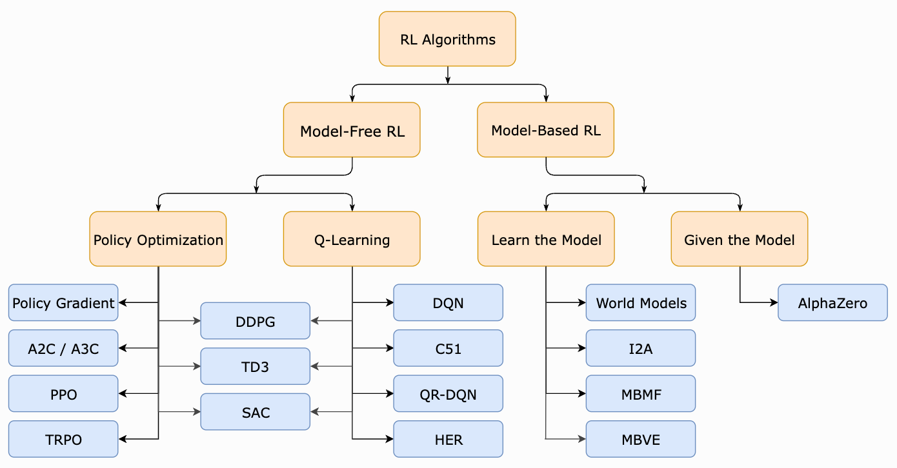

# Governing AI

The AI systems being built now will decide how knowledge and agency are distributed in the next 5-10 years.
Because of this, it falls to us (researchers in ML) all to be knowledgeable enough to think critically about the way these systems are currently set up.

Who should decide how AI is governed?
It would be dangerous for this process to fall into the hands of a privileged few.
So, how can we construct principled systems, ones that ensure that, as the human-AI relationship progresses, it expands human flourishing rather than eroding it? 
How can we work towards a collective project that draws on many forms of wisdom: scientific, ethical, cultural, institutional.

The frameworks that large AI labs currently use to “guide model behavior” currently lack rigor and scientific grounding.

For instance:
- OpenAI relies on a [Model Spec](https://model-spec.openai.com/2025-02-12.html).
- Anthropic has an [AI Constitution](https://constitutional.ai/#definition).

Recent works have highlighted gaps between the ideal behaviors AI companies are declaring and the actual behaviors these models exhibit — for example, see this 2025 paper: [SpecEval: Evaluating Model Adherence to
Behavior Specifications](https://arxiv.org/pdf/2509.02464).

Let's first discuss the current big-picture pipeline.

---

# How Does Post-training Work?

A pre-trained LLM is a **next-token prediction machine**. Much of the work for getting an LLM to output useful responses happens in post-training. You can think of pre-training and condensing large volumes of information into a smart data structure and post-training as a series of algorithms done to extract the required information.

  
*(image credit: [1])*

0. **Define a rubric of ideal behaviors:** This can include follow instructions, be honest and helpful, avoid outputting harmful content.
1. **Supervised Fine-tuning (SFT):** Human annotators provide “gold standard” responses, and models imitate these responses. The model is fine-tuned using supervised learning to minimize the discrepancy between human- and model-generated responses.
2. **Reward-model Training:** The LLM generates two responses, and the human annotates which response they prefer (or ranks multiple responses).
3. **Reinforcement Learning (RL):** The LLM learns how to interact with its environment through trial and error, similar to how a human would learn from experience.
4. **Prompting (In-context learning):** Construct a prompt, or context window, to instruct the model on what to output (this is especially important in long-context settings, such as coding and agentic frameworks).

---
# Schulman's motivation for RLHF. (a problem with SFT). adding factually correct data can sometimes be a net negative.

# RL Defined in an LLM Context
Language modeling fits well with the RL framework.

- **Policy:** A rule used by the generator model to decide which action (token) to take — i.e., the model’s weights.
- **State:** The context or prompt.
- **Action:** The next token that the generator model outputs.
- **Reward:** The score given to an output (typically from a reward model).
- **Value:** The total expected reward starting from a state and acting according to a particular policy.

  
*(image credit: [5])*

---

# Popular RL Paradigms for LLM Post-training

  
*(image credit: [1])*

## PPO (Proximal Policy Optimization) and GPRO (Group Relative Policy Optimization)
  
*(image credit: [2])*

PPO is the most commonly-used algorithm for RLHF and the most complex of the three we’ll discuss. It requires training three models: the generator, the reward, and the critic.

1. The generator model outputs a response, which is scored by the reward model.  
2. The critic model (typically a more skilled model) also outputs a response, which is scored by the reward model.  
3. The difference in reward between the generator and critic responses is used as the training signal.

The GRPO algorithm avoids the use of the value model, replacing it with an **average** of several outputs from the generator model.

---

## DPO (Direct Preference Optimization)
  
*(image credit: [6])*

# Understanding Direct Preference Optimization (DPO)

This note explains the intuition behind **Direct Preference Optimization (DPO)** — how it connects to the KL-constrained RLHF objective, and why its gradient naturally increases the likelihood of *preferred* responses and decreases that of *non-preferred* ones.

---

## 1. From RLHF to DPO

In RLHF, we train a model to maximize expected reward under a **KL constraint** that keeps it close to a reference model (often the SFT model):

\[
\max_{\pi_\theta} \;
\mathbb{E}_{x \sim D, y \sim \pi_\theta(\cdot|x)}
\Big[ r(x, y) \Big]
- \beta \, D_{\text{KL}}\!\big(\pi_\theta(\cdot|x)\|\pi_{\text{ref}}(\cdot|x)\big),
\]

where:
- \(r(x, y)\) is the reward (learned from human preferences),
- \(\pi_{\text{ref}}\) is the reference policy,
- \(\beta\) balances reward maximization and staying close to the reference.

---

## 2. The Optimal Policy under the KL Constraint

For each prompt \(x\), this objective has a closed-form solution:

\[
\pi^*(y|x) \propto \pi_{\text{ref}}(y|x) \, e^{r(x,y)/\beta}.
\]

This says that the optimal policy is a **Boltzmann distribution** over rewards:
- It reweights the reference model’s probabilities,
- Shifting more mass toward higher-reward outputs,
- With the temperature \(\beta\) controlling how strong the shift is.

---

## 3. Pairwise Preferences and the Bradley–Terry Model

Human feedback is often pairwise: given two completions \((y_w, y_l)\), we know which is preferred.

A natural probabilistic model for this is the **Bradley–Terry (logistic) preference model**:

\[
P(y_w \succ y_l \mid x)
= \sigma\!\big(r(x,y_w) - r(x,y_l)\big),
\]
where \(\sigma\) is the logistic sigmoid.

This connects *rewards* to *relative preferences*.

---

## 4. Substituting the Optimal Policy

If we substitute the Boltzmann form of \(\pi^*\) into the preference model, we get:

\[
P(y_w \succ y_l \mid x)
= \sigma\!\Big(
\beta \log \frac{\pi^*(y_w|x)}{\pi^*(y_l|x)}
- \beta \log \frac{\pi_{\text{ref}}(y_w|x)}{\pi_{\text{ref}}(y_l|x)}
\Big).
\]

This shows that **pairwise preferences** can be modeled entirely in terms of **log-likelihood ratios** between the policy and the reference model — no explicit reward model is needed.

---

## 5. The DPO Objective

DPO trains a parameterized model \(\pi_\theta\) to match this form directly, by minimizing the negative log-likelihood of the observed preferences:

\[
\mathcal{L}_{\text{DPO}}(\pi_\theta)
= -\mathbb{E}_{(x, y_w, y_l)}
\Big[
\log \sigma\!\Big(
\beta \big[
\log \tfrac{\pi_\theta(y_w|x)}{\pi_\theta(y_l|x)} 
- \log \tfrac{\pi_{\text{ref}}(y_w|x)}{\pi_{\text{ref}}(y_l|x)}
\big]
\Big)
\Big].
\]

So DPO is just **supervised learning** on preference pairs — it learns a policy whose log-likelihood ratios reflect the relative rewards implied by human feedback.

---

## 6. The Gradient of DPO

Let’s define:
\[
z = \beta \left[
\log \tfrac{\pi_\theta(y_w|x)}{\pi_\theta(y_l|x)} 
- \log \tfrac{\pi_{\text{ref}}(y_w|x)}{\pi_{\text{ref}}(y_l|x)}
\right],
\quad p = \sigma(z).
\]

Then:
\[
\nabla_\theta \mathcal{L}_{\text{DPO}}
= \beta(p - 1)
\Big[
\nabla_\theta \log \pi_\theta(y_w|x)
- \nabla_\theta \log \pi_\theta(y_l|x)
\Big].
\]

During training, we step **in the negative gradient direction**:

\[
-\nabla_\theta \mathcal{L}_{\text{DPO}}
\propto
(1 - p)
\Big[
\nabla_\theta \log \pi_\theta(y_w|x)
- \nabla_\theta \log \pi_\theta(y_l|x)
\Big].
\]

---

## 7. What the Gradient Does

| Model Situation | \(z\) | \(p=\sigma(z)\) | Update Strength | Effect |
|------------------|-------|-----------------|-----------------|--------|
| Strongly prefers \(y_w\) | Large \(+\) | ≈ 1 | Very small | Already aligned |
| Uncertain | ≈ 0 | ≈ 0.5 | Moderate | Push \(y_w\uparrow\), \(y_l\downarrow\) |
| Wrongly prefers \(y_l\) | Negative | ≈ 0 | Strong | Strong correction |

Thus:
- The term \(+\nabla \log \pi_\theta(y_w|x)\) **increases** the likelihood of the preferred response.
- The term \(-\nabla \log \pi_\theta(y_l|x)\) **decreases** the likelihood of the non-preferred response.
- The update magnitude \((1 - p)\) is **adaptive** — larger when the model is most wrong, smaller when it’s already confident.

---

## 8. The Big Picture

| Aspect | RLHF (PPO) | DPO |
|---------|-------------|-----|
| Objective | Maximize reward − β·KL | Same objective, solved analytically |
| Reward | Explicit reward model \(r_\phi\) | Implicitly eliminated via log-ratios |
| Learning Signal | Policy gradient (sampled rollouts) | Supervised log-likelihood gradient |
| Output | Policy approximating Boltzmann optimum | Same policy, without PPO training |

---

## 9. Intuition Recap

- DPO and RLHF solve the **same KL-regularized optimization problem**.
- RLHF does it with a *reward model* and *reinforcement updates*.
- DPO does it *directly*, by regressing the model’s log-likelihood ratios to reflect human preferences.
- The DPO gradient **pushes up preferred responses and down non-preferred ones**, in proportion to how much the model currently disagrees.

---

**In short:**  
> DPO is a closed-form, stable, and interpretable way to perform preference alignment.  
> It increases the log-probability of preferred completions and decreases that of dispreferred ones —  
> precisely as much as needed to satisfy the KL-regularized optimality condition implied by RLHF.

---

Problem: Low signal-to-noise.
This paper[] shows that much of the RLHF signal can be explained by the length of the response. Thus, maybe RLHF generalizes well because there is a ton of data and also can pick up a "gut reaction" for which response is better.
Beyond that, if we want to align the model on more nuanced behaviors (e.g., confront the syncophancy problem) it will requires a more informative training signal.

---

## RLVR (Reinforcement Learning with Verifiable Rewards)
This paper[] shows that even RLVR has low signal-to-noise.

---
# Ways forward

Pluralistic Alignment: 
Inverse Constitutional Alignment: 

# Sources
1. [Proximal Policy Optimization (PPO) — Cameron Wolfe’s Blog](https://cameronrwolfe.substack.com/p/proximal-policy-optimization-ppo) 
2. [DeepSeek R1](https://arxiv.org/pdf/2501.12948#page=3.10)
3. [Stanford CS336 Lecture 15: Alignment — SFT/RLHF](https://web.stanford.edu/class/cs336/)  
4. [LLM Training & Reinforcement Learning - Explanation Video on YouTube](https://www.youtube.com/watch?v=aB7ddsbhhaU)  
5. [An Introduction to Reinforcement Learning for Beginners — AlmaBetter Blog](https://www.almabetter.com/bytes/articles/reinforcement-learning)  
6. [Direct Preference Optimization (DPO) — Cameron Wolfe’s Blog](https://cameronrwolfe.substack.com/p/direct-preference-optimization)

 
