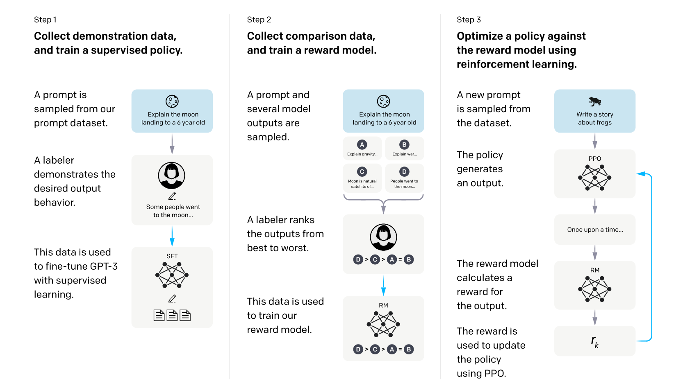

# Governing-LLMs

The frameworks that large AI labs currently use to “guide model behavior” are currently lack of rigor/scientific grounding:
For instance,
Anthropic has an “AI constitution”: https://constitutional.ai/#definition
OpenAI relies on a “model spec”: https://model-spec.openai.com/2025-02-12.html

I’ll start with a walkthrough of how frontier labs are currently executing this in practice, which I anticipate will spark some interesting discussion around the lack of rigor/scientific grounding that goes into these approaches. Then, i’ll plan a discussion on potential ways forward (for making this space more principled).
Recent works have also highlighted gaps between the principles AI companies are declaring and actual behaviors these models exhibit:
https://arxiv.org/pdf/2509.02464

A pre-trained LLM: is a next-token prediction machine.

# What is the Current Pipeline for Post-training?

1. Supervised Fine-tuning: Human annotators provide "gold standard" responses and models imitate those responses. The model is fine-tunned under a supervised learning paradigm to minimize the discrepancy between human-generated responses and responses generated by the model.
2. Reward-model Training: The LLM now generates two responses and humans annotate which response they prefer or rank these responses.
3. Reinforcement Learning (RL): The LLM (agent, generator model) learns how to interact with the environment through trial-and-error, similar to how humans might learn from experiences in the world.
- Is useful in situations where the "best strategy" requires exploration to find.

# RL defined in an LLM context.
- Policy: a rule used by the generator model to decide which best action to take (the generator model's weights).
- State: the context.
- Action: the next token that the generator model chooses to output.
- Reward: the score that is given to an output (typically from a reward model).
- Value: The total expected reward if you start in a state and act according to a particular policy.
  
[insert image of agent-environment interaction rule].

# Popular rl paradigms.

# PPO (aka, proximal policy optimization)
This is the most complicated of the three we will discuss. It requires training three models: the generator model, the reward model, and a critic model.
1. The generator model outputs a response, which is then scored by a reward model.
2. The critic model (typically a more-skilled model) also outputs a response, which is scored by a reward model.
3. The difference in the reward between the generator and critic is used as the training signal.

# DPO (aka, direct policy optimization)
This algorithm avoids the use of the value model, replacing it with an average of several outputs from the generator model.

# GRPO (aka, group relative policy optimization)
This algorithm removes both the critic and reward models, allowing the generator model to evaluate its own actions???
